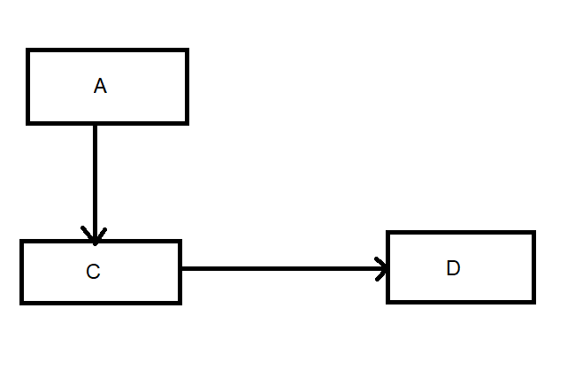
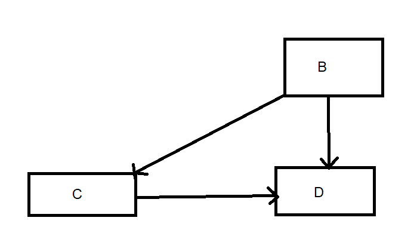

Plan
================
2023-03-18

---
title: "Introduction to Git-Hub"
format: gfm
date: "2023-03-18"
---

# Get Started

→ get started/ setting up GitHub, for details take a look here: https://malikaihle.github.io/Introduction-RStudio-Git-GitHub/
→ Also look for Help at this Tutorial: https://docs.github.com/en/get-started/quickstart/hello-world

There are very very many ways to use Git/GitHub.
Tooling is at once, very important and irrelevant.
It is important that you understand the concepts so that you are able to get things done in every environment.
However, being quick about things is also important, so make sure you are comfortable with the tooling that you use.

Options used in the team are:

* RStudio
* Visual Studio Code
* GitHub Desktop
* plain git cli
* github gh cli

Work in GitHub is organized in Repositories - short: Repos. Those come in different shapes and sizes if you so will and can be created at different places. 

## Cloning of Repos
You can clone a GitHub repository to create a local copy on your computer. In your local repository, you can commit and create a pull request to update the changes in the upstream repository. This might serve the purpose of making it easier to resolve merge conflicts, add or remove files, and push large commits. 

Cloning a repository retrieves a complete copy of all repository data that GitHub.com has at that time, including all versions of every file and folder for the project. You can push your changes to the remote repository on GitHub.com or retrieve other users' changes from GitHub.com.

You can clone your own repository or someone else's repository.

## How to do things No.1
 * Navigate to the main page of the repository and click above the list of files on "Code"
 * Copy the URL for the repository / Open in Github Desktop
     * To clone a repository via HTTPS, click under "HTTPS"
     * If you want to clone the repository using an SSH key, including a certificate issued by your organisation's SSH certification authority, click SSH and   then follow on.
     * To clone a repository using the GitHub CLI, click GitHub CLI and then follow.
 * Open the application you are using git locally with. (Change the current working directory to the location where you want the cloned directory)
 * select that you want to create a cloe, or a repository, then paste the URL you copied earlier!
 * You now should have your own lokal version of the repository
 * You can now upload your cloned repo in your online Git-hub

## Forking an existing Repo
A fork is a new repository that uses the same code and visibility settings as the original "upstream repository". Forks can be used to review ideas or changes before they are proposed for the upstream repository, for example when a user does not have write access to the upstream repository.
Instead of creating issues, you can use forks to suggest changes related to fixing a bug as well.

It is advisable to regularly synchronise your fork with the upstream repository. For this purpose, you need to use Git on the command line.
 
## How to do things No.2
 * For this purpose, you need to use Git in the command line.
 * Navigate to the repository on GitHub.com
 * Click on Fork in the upper right corner of the page.
 * Select an owner/ creator for the forked repository.
 * Name Your Fork
 * Optional: add a description to your fork
 * Select whether only the main or all branches are to be copied into the new fork.
 * Click on "Create Fork"
 * Hint: You now have a fork, but no local copy of the remote repo.. this you can get by cloning 

### Learning goals

 * What is a fork?
 * Is a fork something on GitHub or on your local machine?
 * How is forking different from a clone?
 * What is a remote?
 * Can you have more than one remote?
 * Why do you need a fork?
 * How to create a fork?

## What is the fork for?
 * You can now make any changes to the fork, including:
     * Creating Branches: Branches allow you to create new features or try out ideas without compromising your main project.
     * Opening pull requests: If you want to contribute to the upstream repository, you can send the original author a request to populate your fork into            their repository by submitting a pull request.

## How to do things No.3
 * Creating a Branch in an existing Repo 
 * "Main" -> either choose an existing branch other than the main branch, or create a new branch (preferably with a name saying what its for)
 * Creating a new file - including a model in Lavaan
 * "Add file" or upload code from R-Studio/ Vs Code
 * Create a pull request from the branch to the main branch
 * --> For detailed instructions for steps 1-4 take a look here: https://malikaihle.github.io/Collaborative-RStudio-GitHub/

## Collaboratively combine the different models in one model all together No.1
### Model 1

### Model 2

### Model 3

## Use Issues to communicate problems that might occure 
 * tag the others in the issues to keep them updated and to make them aware of the issue
 * assign someone to a project
 * discuss the issues, using the commentary function beneath the issues

## What You should have a mental model of in the end
 * PR reviewen
 * PR revisen
 * PR mergen
 * PR merge conflicts beheben
 * PR in project management software
 * You should by then be owner of your repository, should be collaborating on the merged repository, and ideally should have reviewed repositories, when        issues came up(owner, collaborator, reviewer).

## Collaboratively combine the different models in one model all together No.2
### Transfering the Models from lavaan into Stenograph!
 * --> Find the Stenographs package here: https://github.com/aaronpeikert/StenoGraphs.jl
 * -> open VS-Code -> create a new script and select Julia as language -> install the package
  
## The Good, The Bad & The Ugly - Good Practice in Git
With Git/ Github there are many possible ways to do stuff and to reach your goals. Nevertheless somethings regarding good practice dont change and they will be of service to you in the future. You will notice, that some of those practices are more convenient depending on the tool you use, but they overall apply regardeless.
 * Never commit changes directly onto the 'main' branch

